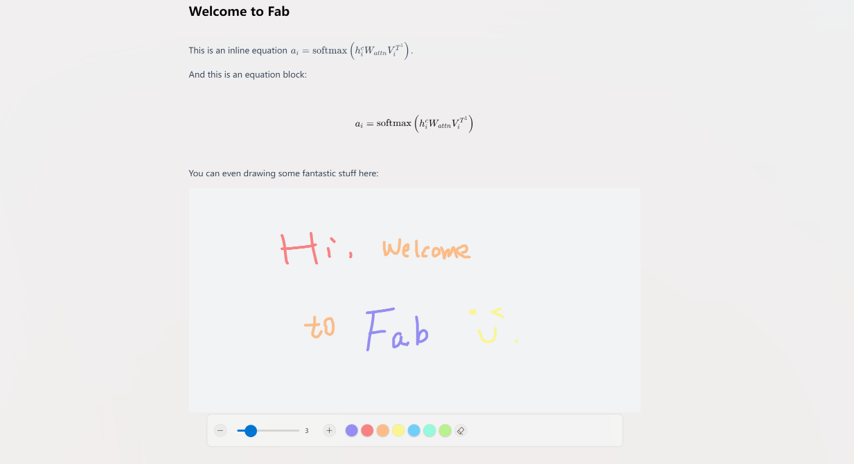

# FabNote



FabNote is a VS Code extension for opening and editing `.fbn` files with a custom editor powered by `@creatorsn/powereditor3`. Architecturally, it is a VS Code extension host plus a Vue 3 + Vite webview frontend. When a `.fbn` file is opened, the extension loads the built frontend from `media/` and renders the editing experience inside VS Code.

## Documentation

- Chinese overview: [docs/README.zh.md](docs/README.zh.md)
- Chinese development and release guide: [docs/开发与发布.md](docs/开发与发布.md)

## Features

- Registers `.fbn` as the `FabNote` file type
- Opens `.fbn` files with a VS Code Custom Editor
- Uses a Vue 3 + Vite webview frontend
- Uses `@creatorsn/powereditor3` for the editor experience
- Includes a custom `.fbn` file icon
- Provides a `Preview FabNote` command to open the current file in the custom editor

## Project Structure

```text
fabnote/
|- extension.js           VS Code extension entry
|- package.json           Extension manifest and metadata
|- media/                 Built webview assets loaded by the extension
|- webview-ui/            Vue 3 + Vite frontend project
|- utils/file-icons/      Icon assets for .fbn files
|- docs/                  Project docs and screenshots
|- test/                  VS Code extension tests
```

## Requirements

- Node.js 18+ or 20+
- Yarn 1.x
- VS Code 1.102.0+

## Install Dependencies

The extension root and `webview-ui/` are separate Node projects, so install both:

```bash
yarn
cd webview-ui
yarn
```

## Local Development

### Recommended Flow

For daily development, use `F5` in VS Code instead of `yarn test`.

Important: if you changed anything under `webview-ui/`, you must run `yarn build` first so the latest frontend is written to `media/`. Only after that should you press `F5`. Otherwise the Extension Development Host will still load stale assets.

Steps:

1. Open the repository root in VS Code
2. If the frontend changed, run `cd webview-ui && yarn build`
3. Press `F5`
4. Choose `Run Extension` from `.vscode/launch.json`
5. Wait for the new `Extension Development Host` window

`F5` is for extension debugging and manual verification. `yarn test` is for automated tests and exits after running.

### Build the Webview Frontend

FabNote loads assets from the root `media/` directory, so frontend changes must be built first:

```bash
cd webview-ui
yarn build
```

This uses [webview-ui/vite.config.js](webview-ui/vite.config.js) to emit the build output directly into `media/`.

### Verify the `.fbn` Editor

In the Extension Development Host:

1. Open or create a `.fbn` file
2. If it does not automatically open with the custom editor, run `Preview FabNote`
3. The extension will call `vscode.openWith` with `fbnPreview.customEditor`

If the file is empty, the extension loads built-in sample content as initial data.

## Common Commands

### Extension Root

```bash
yarn lint
yarn test
```

- `yarn lint`: lint extension-side code
- `yarn test`: run VS Code extension tests

### `webview-ui/`

```bash
yarn dev
yarn build
yarn preview
```

- `yarn dev`: run the standalone Vite dev server
- `yarn build`: build and overwrite root `media/`
- `yarn preview`: preview the production build

## Package a VSIX

The repository does not currently define a package script for publishing, so use `vsce` directly:

```bash
npx @vscode/vsce package
```

This generates a file like `fabnote-0.0.3.vsix` in the repository root.

To install the local package:

```bash
code --install-extension fabnote-0.0.3.vsix
```

## Publish to VS Code Marketplace

If your publisher and PAT are already configured:

```bash
npx @vscode/vsce publish
```

Typical release flow:

1. Update `version` in `package.json`
2. Rebuild the frontend with `cd webview-ui && yarn build`
3. Run `yarn lint`
4. Optionally run `yarn test`
5. Run `npx @vscode/vsce package` or `npx @vscode/vsce publish`

If you need to log in first:

```bash
npx @vscode/vsce login CreatorSN
```

## How It Works

- Entry point: [extension.js](extension.js)
- Registers `fbnPreview.customEditor` with `registerCustomEditorProvider`
- Reads file content and sends it to the webview
- Receives edited content back from the webview
- Saves the content back into the `.fbn` file

## Notes

- `media/` is generated output and should not be edited manually
- The repository already contains a packaged artifact: `fabnote-0.0.3.vsix`
- [webview-ui/README.md](webview-ui/README.md) is still the default frontend template README and can be cleaned up later if needed

## License

[LICENSE](LICENSE)
